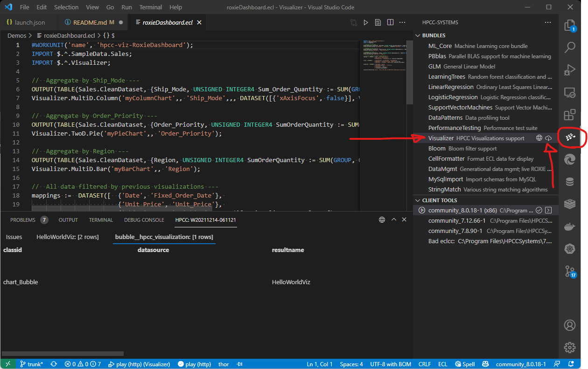

*Visualization Introduction*
============================

The Visualization bundle is an open-source add-on to the HPCC platform to allow you to create visualizations from the results of queries written in ECL.

Visualizations are an important means of conveying information from massive data. A good visual representation can help a human produce actionable analysis. A visually comprehensive representation of the information can help make the obscure more obvious.

Pie Charts, Line graphs, Maps, and other visual graphs help us understand the answers found in data queries. Crunching big data is only part of a solution; we must be able to make sense of the data, too. Data visualizations simplify the complex.

The Visualizer bundle extends the HPCC platform's functionality by allowing you to plot your data onto charts, graphs, and maps to add a visual representation that can be easily understood.

In addition, the underlying visualization framework supports advanced features to allow you to combine graphs to make interactive dashboards.


Installation
============

## VS Code with ECL Extension

If you are using the [ECL Extension for VS Code](https://marketplace.visualstudio.com/items?itemName=hpcc-systems.ecl) you can install any of the official bundles via the HPCC Systems icon on the activity bar:



## `ecl bundle` command line tool

### With `git`

To use this method, you will need to have both the `client tools` and `git` installed on your machine and accessible to the user (in the path).
```
ecl bundle install https://github.com/hpcc-systems/Visualizer.git
```

**Note**:  You may find it easier to manually set the PATH to include the ecl client tools:
```
set PATH=%PATH%;"c:\Program Files (x86)\HPCCSystems\6.2.0\clienttools\bin"
```

### Without `git`

To install using the `client tools` without `git`:
1. Download:  https://github.com/hpcc-systems/Visualizer/archive/trunk.zip
2. Unzip to “Visualizer” folder:  ```<USERS_FOLDER>\Downloads\Visualizer-trunk.zip```

**Note**:  Depending on your zip tool the path below may vary slightly
```
ecl bundle install <USERS_FOLDER>\Downloads\Visualizer-trunk\Visualizer-trunk
```

All going well you should see:
```
Installing bundle Visualizer version 2.1.1
Visualizer    2.1.1      ECL Visualization Bundle
Installation complete
```

Using the Visualization library
===============================

Once installed, you merely IMPORT the library, then call any method that is appropriate for your data shape.

For Example:
```
IMPORT Visualizer;
ds := DATASET([ {'English', 5},
                {'History', 17},
                {'Geography', 7},
                {'Chemistry', 16},
                {'Irish', 26},
                {'Spanish', 67},
                {'Bioligy', 66},
                {'Physics', 46},
                {'Math', 98}],
                {STRING subject, INTEGER4 year});
OUTPUT(ds, NAMED('chartData'));
Visualizer.TwoD.pie('myChart',, 'chartData');
```

Viewing the Visualization
=========================

After running a query with a visualization included, you can see the visualization in ECL Watch.

Open the workunit, then select the **Resources** tab.
